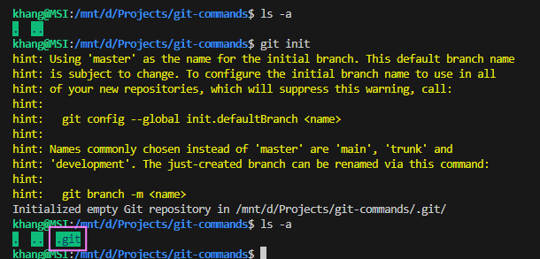
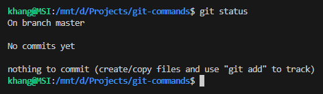
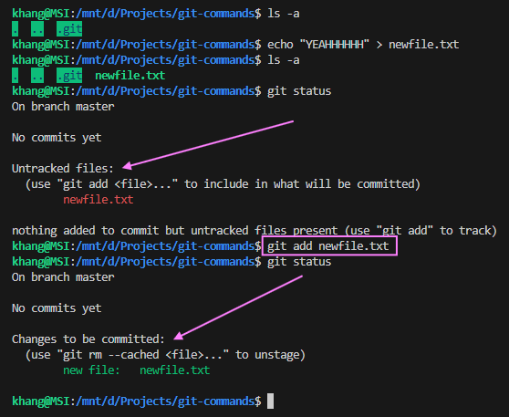
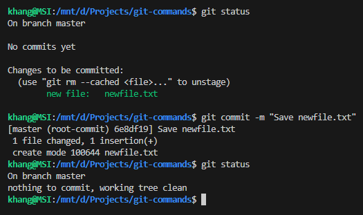
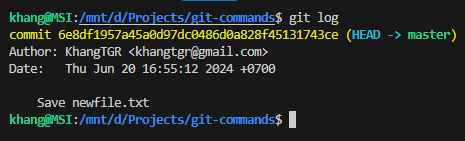
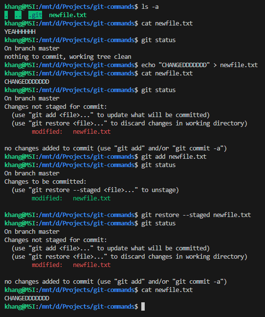
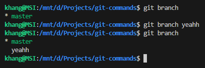
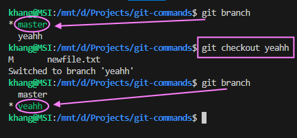
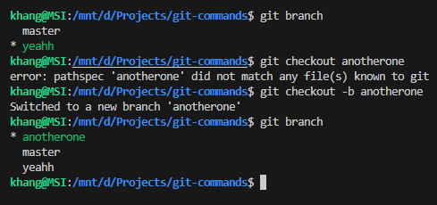

# Các Câu Lệnh Git

## Mục lục

- [Các Câu Lệnh Git](#các-câu-lệnh-git)
  - [Mục lục](#mục-lục)
  - [1. `git init`](#1-git-init)
  - [2. `git status`](#2-git-status)
  - [3. `git add`](#3-git-add)
  - [4. `git commit`](#4-git-commit)
  - [5. `git log`](#5-git-log)
  - [6. `git restore`](#6-git-restore)
  - [7. `git branch`](#7-git-branch)
  - [7. `git checkout`](#7-git-checkout)
  - [8. `git merge`](#8-git-merge)

## 1. `git init`

Câu lệnh <code><span style="color:#ffcc99;">git init</span></code> được sử dụng để khởi tạo một kho chứa Git mới.

```sh
git init
```



## 2. `git status`

Câu lệnh <code><span style="color:#ffcc99;">git status</span></code> hiển thị trạng thái làm việc hiện tại của thư mục làm việc và chỉ mục của Git.

```sh
git status
```



## 3. `git add`

Câu lệnh <code><span style="color:#ffcc99;">git add</span></code> được sử dụng để đưa các thay đổi từ thư mục làm việc vào chỉ mục (index) của Git.

```sh
git add file.txt
```



## 4. `git commit`

Câu lệnh <code><span style="color:#ffcc99;">git commit</span></code> lưu trữ các thay đổi đã được thêm vào chỉ mục trong kho chứa Git.

```sh
git commit -m "Commit message"
```



## 5. `git log`

Câu lệnh <code><span style="color:#ffcc99;">git log</span></code> hiển thị lịch sử các commit.

```sh
git log
```



## 6. `git restore`

Câu lệnh <code><span style="color:#ffcc99;">git restore</span></code> được sử dụng để khôi phục các tệp đã thay đổi trong thư mục làm việc.

```sh
git restore --staged file.txt
```



## 7. `git branch`

Câu lệnh <code><span style="color:#ffcc99;">git branch</span></code> được sử dụng để hiển thị danh sách các nhánh của kho chứa Git, còn nếu điền tên sau câu lệnh, thì sẽ tạo ra nhánh mới.

```sh
git branch 
```
```sh
git branch new_branch_name
```



## 7. `git checkout`

Câu lệnh <code><span style="color:#ffcc99;">git checkout</span></code> được sử dụng để chuyển đổi giữa các nhánh hoặc khôi phục các tệp đã thay đổi.

```sh
git checkout branch_name
```



Sử dụng tùy chọn <code><span style="color:#ffcc99;">-b</span></code> sẽ vừa tạo nhánh mới và di chuyển đến nhánh vừa tạo. 

```sh
git checkout -b new_branch_name
```



## 8. `git merge`

Câu lệnh <code><span style="color:#ffcc99;">git merge</span></code> được sử dụng để hợp nhất các thay đổi từ một nhánh vào nhánh hiện tại.

```sh
git merge branch_name
```
