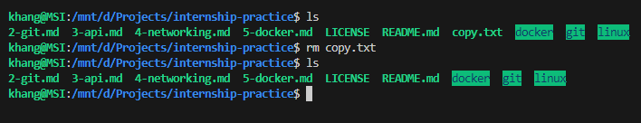

# Câu Lệnh Ubuntu

## Mục lục

- [Câu Lệnh Ubuntu](#câu-lệnh-ubuntu)
  - [Mục lục](#mục-lục)
  - [1. `pwd` + đường dẫn `~`](#1-pwd--đường-dẫn-)
  - [2. `ls`](#2-ls)
  - [3. `cd`](#3-cd)
  - [4. `mkdir`](#4-mkdir)
  - [5. `touch`](#5-touch)
  - [6. `echo` + `cat`](#6-echo--cat)
  - [7. `nano`](#7-nano)
  - [8. `cp`](#8-cp)
  - [9. `mv`](#9-mv)
  - [10. `rm` + `rmdir`](#10-rm--rmdir)
  - [11. `sudo`](#11-sudo)
  - [12. `apt`](#12-apt)

## 1. `pwd` + đường dẫn `~`

Câu lệnh <code><span style="color:#ffcc99;">pwd</span></code> (Print Working Directory) dùng để hiển thị đường dẫn thư mục hiện tại.

```sh
pwd
```


Mỗi user trong hệ thống có một thư mục riêng tại đường dẫn /home, và <code><span style="color:#ff9999;">~</span></code> là ký hiệu cho thư mục của user hiện tại. Ví dụ, nếu user là <code><span style="color:#ff9999;">khang</span></code>, khi chuyển đến thư mục <code><span style="color:#ff9999;">~</span></code> và sử dụng lệnh <code><span style="color:#ffcc99;">pwd</span></code>, đường dẫn sẽ hiển thị là <code><span style="color:#ffcc99;">/home/khang</span></code>.

## 2. `ls`

Câu lệnh <code><span style="color:#ffcc99;">ls</span></code> dùng để liệt kê các tệp tin và thư mục trong thư mục hiện tại.

```sh
ls
```


Tuy nhiên, khi thực thi lệnh <code><span style="color:#ffcc99;">ls</span></code>, các thư mục và tệp ẩn sẽ không được hiển thị. Để hiển thị tất cả, bao gồm các tệp và thư mục ẩn (được nhận dạng bằng dấu <code><span style="color:#ff9999;">.</span></code> trước tên), sử dụng tùy chọn <code><span style="color:#ffcc99;">-a</span></code> của lệnh <code><span style="color:#ffcc99;">ls</span></code>, tức là <code><span style="color:#ff9999;">all</span></code>. Câu lệnh này sẽ hiển thị mọi tệp và thư mục, bao gồm cả các tệp và thư mục ẩn.

```sh
ls -a
```

## 3. `cd`

Câu lệnh <code><span style="color:#ffcc99;">cd</span></code> (Change Directory) dùng để di chuyển giữa các thư mục.

```sh
cd /path/to/directory
```


Để lùi về thư mục cha, sử dụng ký hiệu <code><span style="color:#ff9999;">..</span></code> với lệnh:

```sh
cd ..
```

## 4. `mkdir`

Câu lệnh <code><span style="color:#ffcc99;">mkdir</span></code> (Make Directory) dùng để tạo một thư mục mới.

```sh
mkdir new_directory
```


Có thể sử dụng tùy chọn <code><span style="color:#ffcc99;">-p</span></code> khi tạo thư mục để tự động tạo ra các thư mục cha nếu chưa tồn tại:

```sh
mkdir -p /new_directory/new_directory
```


## 5. `touch`

Câu lệnh <code><span style="color:#ffcc99;">touch</span></code> dùng để tạo một tệp tin mới hoặc cập nhật thời gian truy cập của tệp tin hiện có.

```sh
touch new_file.txt
```


## 6. `echo` + `cat`

Câu lệnh <code><span style="color:#ffcc99;">echo</span></code> dùng để hiển thị thông tin ra màn hình hoặc ghi vào tệp tin.

```sh
echo "Hello, World!"
```
```sh
echo "Hello, World!" > file.txt
```

Câu lệnh <code><span style="color:#ffcc99;">cat</span></code> (Concatenate) dùng để hiển thị nội dung của một hoặc nhiều tệp tin.

```sh
cat file.txt
```


## 7. `nano`

Câu lệnh <code><span style="color:#ffcc99;">nano</span></code> mở trình soạn thảo văn bản Nano để chỉnh sửa tệp tin.

```sh
nano file.txt
```

Gõ tổ hợp phím <code><span style="color:#ff9999;">Ctrl+S</span></code> để lưu và <code><span style="color:#ff9999;">Ctrl+X</span></code> để thoát.


## 8. `cp`

Câu lệnh <code><span style="color:#ffcc99;">cp</span></code> (Copy) dùng để sao chép tệp tin hoặc thư mục.

```sh
cp source_file.txt destination_file.txt
```


## 9. `mv`

Câu lệnh <code><span style="color:#ffcc99;">mv</span></code> (Move) dùng để di chuyển hoặc đổi tên tệp tin hoặc thư mục.

```sh
mv file.txt /new_destination/file.txt
```


```sh
mv old_name.txt new_name.txt
```


## 10. `rm` + `rmdir`

Câu lệnh <code><span style="color:#ffcc99;">rm</span></code> (Remove) dùng để xóa tệp tin.

```sh
rm file.txt
```



Câu lệnh <code><span style="color:#ffcc99;">rmdir</span></code> (Remove Directory) dùng để xóa thư mục trống.

```sh
rmdir directory_name
```


Cũng có thể sử dụng câu lệnh <code><span style="color:#ffcc99;">rm</span></code> với tùy chọn <code><span style="color:#ffcc99;">-r</span></code> để xóa thư mục không trống.


## 11. `sudo`

Câu lệnh <code><span style="color:#ffcc99;">sudo</span></code> (Super User Do) cho phép người dùng chạy các lệnh với quyền quản trị.

```sh
sudo apt update
```

## 12. `apt`

Câu lệnh <code><span style="color:#ffcc99;">apt</span></code> (Advanced Package Tool) dùng để quản lý các gói phần mềm trong hệ thống Ubuntu.

```sh
sudo apt update
sudo apt install package_name
```
